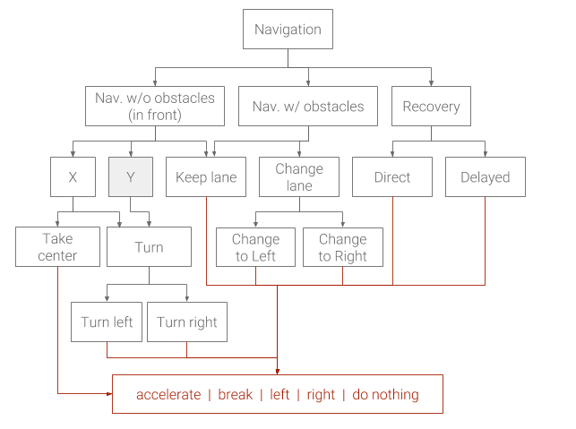

# Hierarchical Reinforcement Learning (with batteries included)

This repo replicates this hierarchy for a theoretical AV



## Installation

this repo mainly uses two big other repos, `stable-baselines` and `CarRacing_v1` (not `CarRacing_v0` from openai gym).

#### 1. Install this repo

0. If you prefer, create a new conda environemnt (`conda create -n HRL`) and activate it (`source activate HRL`).
1. Clone this repo with `git clone https://github.com/NotAnyMike/HRL` and `cd` into it with `cd HRL`.
2. Install the repo with `pip install -e .`.

#### 2. Install CarRacing_v1

1. Clone CarRacing_v1 from [https://github.com/NotAnyMike/gym](https://github.com/NotAnyMike/gym) with `git clone https://github.com/NotAnyMike/gym`.
2. `cd` in the repo with `cd gym` and install it with `pip install -e ".[Box2D]"`

If the environment is correctly installed, you should be able to play by running `python car_racing.py` using the arrows and space bar and quit by pressing `Q`.

#### 3. Install Stable baselines

1. Install `stable-baselines` with `pip install stable-baselines`
2. Last, install the requirements.txt with `pip install -r requirements.txt` in the HRL repo.


## How to run experiments

Running experiments supports logging and saving of all the experiment important information. Using the function `run_experiment` in the `source` folder. All the files will be saved in a folder inside the `folder` folder and will be named `<id>_<tag>` where `<id>` is the id in the id experiments table and `<tag>` is the tag argument.

### Using `run_experiment`

The function `run_experiment` takes several different arguments, here it is a table of a summary of all of them

| Argument | Type of value | Default value | Description |
| --- | --- | --- | --- |
| `env` | str | 'Base' | The name of the class of the environment to use for the experiment |
| `train_steps` | int | 1.000.000 | The total number of steps to train for |
| `n_steps` | int | 200 | The number of steps to use in each training steps for the optimisation (similar to a buffer) |
| `gamma` | float | 0.99 | Discount factor to use in training |
| `max_steps` | int | None | The value of `max_steps` for the environment option |
| `save_interval` | int | 10.000 | Save the weights will save every `save_interval` steps |
| `weights` | str | None | Path of the weights to use |
| `n` | int | 0 | The number of steps from where to start counting the next steps (in case continuing training) |
| `not_save` | bool | False | Whether or not save and log the experiment |
| `folder` | str | 'experiments' | The name of the folder where to save everything, cannot be empty |
| `env_num` | int | 4 | Number of parallel environment to use for training |
| `tag` | str | None | Tag to use in the name of the folder where everything about the experiment will be saved |
| `description` | str | None | A small description of the experiment. Will be saved in the csv file created |

Running an experiment outside docker has the advantage of been able to activate the frame buffer to see how well the model is performing live and then deactivate the buffer again to make the training faster.

#### Running an experiment

Running 

```bash
python hrl/common/run_experiment.py --folder toremove --env_num 1
```

will run a simple experiment using the `Base` environment. You can change the environment with the `--env` parameter.  Using hierarchical environments will consume more memory, the higher the model in the hierarchy the more models it is necessary to load, thus the more memory needed.

##### Existing Environments

| Hierarchical    | Non hierarchical                 | Description                                                  |
| --------------- | -------------------------------- | ------------------------------------------------------------ |
|                 | Base                             | Basic environment, nothing special                           |
|                 | Original                         | Simulates the original CarRacing_v0                          |
|                 | Keep_lane                        | To train agents capable of keeping the same lane and navigating efficiently |
| NWOO, NWOO_B/C: | NWOO_n2n, NWOO_B_n2n,            | Navigation WithOut Obstacles                                 |
| NWO             | NWO_n2n                          | Navigation With Obstacles                                    |
| Turn_v2         | Turn_v2_n2n                      | Turn in an intersection to left or to right                  |
| X_v2            | X_v2_n2n                         | X intersections (left,right,center)                          |
|                 | Take_center_v2                   | Knows how to take the middle lane in an intersection         |
|                 | Turn_side_v2, Turn_right/left_v2 | Knows how to take the left/right lane in an intersection     |
| Change_lane_A/B | Change_lane_n2n                  | Change from the left to the right lane (and vice-versa)      |
|                 | Change_to_left/right             | Changes to one specific lane                                 |
|                 | Recovery/_delayed/direct         | In case of drift                                             |
| Nav             | Nav_n2n                          | The main model                                               |

You should be able to play any of the environments above. You should be able to play any non-hierarchical environment without any extra models or weights, but in order to play any hierarchical model you will need to have the options it is using available (which are included in this repo).

```bash
python hrl/envs/env.py -e Nav_n2n
```

The non-hierarchical environments uses normal arrow keys and space-bar. The hierarchical environments use numbers, so `1` will be the first option available to the model, etc. Hierarchical environments will wait for the input to render the next frame. You can also open a live view of the hierarchy by pressing `B`, you can closes by pressing `B` again.

##### Cancelling an experiment

if the experiment is not going well and it is not useful to save all that data, after doing `ctrl+c` you will be prompted whether or not you want to keep the data or remove it.

#### Docker

I suggest using docker in order to run experiments, makes the experiment consume less memory. The docker images are available in the `docker` folder. You can use the model creating a virtual frame buffer with `xvfb-run -a -s "-screen 0 1400x900x24 +extension RANDR" --`. Docker **does not** work to watch the agent in the environment because there is no real frame buffer to render the environment. 

#### Using Docker to run experiments

TODO: Complete readme, meanwhile you can use the bash file `run_experiment_docker.sh` in the root folder

#### Generating tracks

One of the most expensive operation is to generate maps. To alleviate this you can pre-regenerate as many maps as you want to avoid the model generating maps while training. This gives you the option of filtering the maps in which you want to train and speeds up training significantly.

##### Downloading generated maps

##### Generating tracks yourself

TODO: complete readme. Meanwhile there is a `track_generator.py` file inside `hrl.common` which can be used to generate tracks easily. 

---

### Using `run_model`

`run_model` runs the model specified in the environment specified. The only important argument to give is the name of the experiment, e.g. `-e experiment1`, that will run the last saved weights with the base environment.

```

```

#### Parameters of `run_model`

Not all the following parameters are mandatory. Certain options require some other options to be specified.

| Argument           | Type | Default value | Description                                                  |
| ------------------ | ---- | ------------- | ------------------------------------------------------------ |
| `env`              | str  | Base          | The name of the class of the environment to run on, if not specified Base is used. |
| `policy`           | str  | None          | The name of the policy to load, it must have a folder in the `hrl.policies` folder and one weight inside, the newest will be run. if this option is given `-f`,`-e`,`-w`, `--full_path` are ignored |
| `full_path`        | str  | None          | The full path of the weights, can be relative or absolute, if this is given then `-f`,`-e`,`-w` are ignored. |
| `folder`,`f`       | str  | 'experiments' | The folder of the experiments, by default it is 'experiments', it is also used to save the logs if `-tb` is passed |
| `experiment`,`e`   | str  |               | The name of the folder of the experiment, the name of the experiment, for example '2_base'. Used to construct `full_path` if not given. |
| `weights`,`w`      | str  | None          | The name of the weights to load, If not specified we run the last one or 'weights_final'. |
| `n_steps`,`n`      | int  | 200           | The number of steps to run for, if not specified then infinite |
| `n_ep`             | int  | 0.99          | The number of steps to run for, if not specified then infinite |
| `tensorboard`,`tb` | bool | True          | A flag to register the score with tensorboard                |
| `tag`,`t`          | str  | None          | The tag for the folder in case of using tensorboard flag     |
| `no_render`        | bool | False         | In case you want to log some info, but do not care about rendering in screen. |

